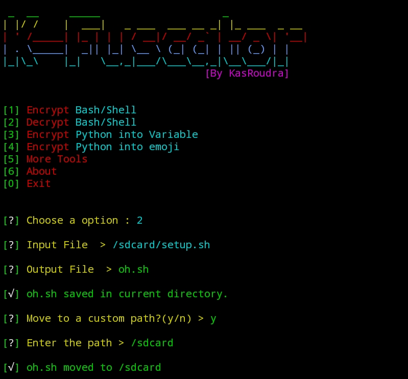

# K-fuscator

### [+] Created By <a href="https://github.com/Andraxvpn">Andraxvpn</a>

### [+] Decription :
***K-fuscator is a tool to encrypt(obfuscate) or decrypt bash/shell script or compile python script. Compilation is available in variable or emoji.***

### [+] Installation

```apt install git python -y```

```git clone https://github.com/Andraxvpn/bash```

```cd k-fuscator```

```bash requirements.sh```

```python3 kf.py```


### Or, Use Single Command
```
apt install git python -y && git clone https://github.com/Andraxvpn/bash && cd k-fuscator && bash requirements.sh && python3 kf.py
```

### Features:
1. Encrypt or Decrypt bash/shell file
2. Encrypt python file into emojies
3. Encrypt python file into custom variables

## Screenshots:

#### Main View:



#### Bash Source Code


#### Encrypted Bash


#### Decrypted Bash


#### Python Source Code


#### Python Emoji Encryption


#### Python Variable Encryption


## This repository is open source to help others. So if you wish to copy, consider giving credit!

### Credits: <a href="https://github.com/H3LLO-H4CK3R-2/Bash-Encrypt">H3LL0-H4CK3R</a> and <a href="https://github.com/wodxgod/Simple-obfuscator">WodxGod</a> and <a href="https://github.com/chris-rands/emojify">Chris-Rands</a> 


